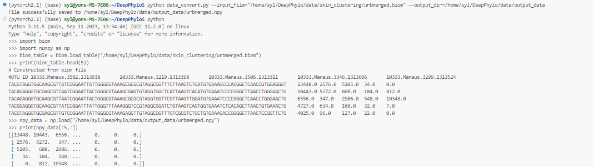

# DeepPhylo: A phylogeny-aware machine learning approach to enhance predictive accuracy in human microbiome data analysis

 DeepPhylo, a method that employs phylogeny-aware amplicon embeddings to integrate abundance and phylogenetic information, thereby improving both the unsupervised discriminatory power and supervised predictive accuracy of microbiome data analysis. 


Compared to the existing methods, DeepPhylo demonstrated superiority in informing biologically relevant insights across four real-world microbiome use cases, including clustering of skin microbiomes, prediction of host chronological age and gender, and inflammatory bowel disease (IBD) diagnosis across 15 datasets.

This repository contains script which were used to train the DeepPhylo model with the scripts for evaluating the model's performance.

## Dependencies
* The code was developed and tested using python 3.9.
* To install python dependencies run:
  `pip install -r requirements.txt`

## Installation
You can either clone the public repository:

```bash
# clone project
git clone https://github.com/CNwangbin/DeepPhylo
# First, install dependencies
pip install -r requirements.txt
```

Once you have a copy of the source, you can install it with:

```bash
python setup.py install
```

###  Data file descriptions
`txt` :A txt file is used to store metadata information for the skin_clustering analysis. This plain text file might include various attributes or classifications related to the samples, serving as input for clustering algorithms.
```
sample_name,ac_sampled_room,accult_score,analysis_name,animals_in_house
10333.BLANK.1.1A,not applicable,not applicable,BLANK1,not applicable
```
`npy`: A npy file is the result of converting a biom file. It contains numerical data representing the abundance of different features in the dataset, stored in a format optimized for fast loading and processing with NumPy.Its value is the result of normalized absolute abundance.

| microbe1  | microbe2 | microbe3 | 
|:--------|:---:|--------:|
| 0.26    | 0.15 |    0.01 |
| 0.1     |  0.2 |    0.24 |
| 0.3 |  0.05 | 0.04|


`biom`: A biom file represents the absolute abundance of OTUs (Operational Taxonomic Units) obtained from 16S sequencing. This format is widely used in microbial ecology for storing abundance data along with sample and feature metadata.

|#OTU ID| Sample1| Sample2|...|
|---|---|---|---|
|microbe1|120|52|...|
|microbe2|32|168|...|
|...|...|...|...|


`qza`: A `qza` file contains phylogenetic tree information, typically used in bioinformatics workflows. This file is a standard format in the QIIME 2 ecosystem, encapsulating data and metadata in a compressed archive.

| QZA File Name    | Description                                                      | Data Type           | Usage in Analysis                         |
|------------------|------------------------------------------------------------------|---------------------|-------------------------------------------|
| `taxonomy.qza`   | Contains the taxonomic assignments for each feature in the dataset. This file maps the features (e.g., OTUs, ASVs) to their respective taxonomic classifications, such as phylum, class, order, family, genus, and species. | Taxonomic Data      | Used for generating taxonomic bar plots, summarizing the composition of microbial communities, and performing differential abundance analysis. |


`pth`: A `pth` file stores the best model parameters. This file is used in deep learning frameworks like PyTorch to save and load model states, allowing for model checkpoints and fine-tuning.

| File Name      | Description                                                      | Data Type          | Usage in Analysis                          |
|----------------|------------------------------------------------------------------|--------------------|--------------------------------------------|
| `/home/syl/DeepPhylo/data/age_regression/best_model.pth`    | Stores the best model parameters learned during training. This file contains weights, biases, and other parameters that define the state of a deep learning model at a particular checkpoint. | Model Parameters   | Used for loading the trained model to make predictions, continue training, or perform fine-tuning on new data. |


### Data convert
To perform the necessary data transformation, we require the original biom abundance table as an input. This table will serve as the basis for subsequent operations, where it will be converted into an npy file format. Please ensure that the biom file is provided so that we can proceed with the transformation process seamlessly.

```

python data_convert.py --input_file="/home/syl/DeepPhylo/data/skin_clustering/urbmerged.biom" --outfile=/home/syl/DeepPhylo/data/output_data

```


## Model Parameter
| Parameter | Value  | Description                                                                                   |
|-----------|--------|-----------------------------------------------------------------------------------------------|
| `-hs`     | 16     | Hidden size: Number of units in the hidden layers of the neural network. Determines the capacity of the model to learn complex patterns. |
| `-kec`    | 7      | Kernel size: Size of the convolutional kernel used in the model, defining the receptive field of the network's filters. |
| `-l`      | 1e-4   | Learning rate: Controls the step size at each iteration while moving toward a minimum of the loss function. A smaller value makes the learning process slower and more precise. |
| `-bs`     | 64     | Batch size: Number of training examples utilized in one iteration. A larger batch size generally leads to more stable gradient updates. |
| `-kep`    | 2      | Kernel expansion: Factor by which the size of the kernel is expanded, used in advanced convolution operations to capture larger patterns. |
| `-d`      | 0.2    | Dropout rate: Fraction of the input units to drop during training, used as a regularization method to prevent overfitting. |
| `-p`      | 0.0    | Dropout probability: Probability of applying dropout at each layer, controlling the regularization strength. |
| `-act`    | 'sigmoid' | Activation function: Type of activation function applied to the network's output, with 'sigmoid' used for binary classification problems. |
| `-test_X` |data/gender_classification/X_test.npy' | Enter existing npy file data|
| `-test_Y` |data/gender_classification/Y_test.npy' | Enter existing npy label file data|


## Running
* Download all the data files and place them into data folder


## Scripts
The scripts here are using to run the model.

- to train and evaluate a model using DeepPhylo in gender prediction run sh: 
```bash
python deepphylo_classification.py --epochs 500 -hs 80 -kec 3 -l 0.0001 -bs 32 -kep 7 -act relu 
```

- to test a model using DeepPhylo in gender prediction run sh: 
```bash
python deepphylo_classification_inference.py -test_X 'data/gender_classification/X_test.npy' -test_Y 'data/gender_classification/Y_test.npy'  -hs 80 -kec 3 -l 0.0001 -bs 32 -kep 7 -act relu 
```

- to train and evaluate a model using DeepPhylo in age prediction run sh: 
```bash
python deepphylo_regression.py --epochs 500 -hs 40 -kec 7 -l 0.0002 -bs 8 -kep 7 -act tanh
```

- to test a model using DeepPhylo in age prediction run sh: 
```bash
python deepphylo_regression_inference.py -test_X '/home/syl/DeepPhylo/data/age_regression/X_test.npy' -test_Y 'data/age_regression/Y_test.npy' -hs 40 -kec 7 -l 0.0002 -bs 8 -kep 7 -act tanh
```

- to train and evaluate a model using DeepPhylo in IBD microbiome-based diagnosis run sh: 
```bash
python python deepphylo_ibd_diagnosis.py -hs 16 -kec 7 -l 1e-4 -bs 64 -kep 2 -act sigmoid -d 0.2
```

- to test a model using DeepPhylo in IBD microbiome-based diagnosis run sh: 
```bash
python deepphylo_ibd_diagnosis_inference.py  -hs 16 -kec 7 -l 1e-4 -bs 64 -kep 2 -d 0.2 -p 0.0 -act 'sigmoid'
```

* mystem_rpca.ipynb - Jupyter notebook to run unsupervised method on skin microbiome samples.

## Citation

If you use DeepPhylo for your research, or incorporate our learning algorithms in your work, please cite:


## New version specifications
Current dependencies can be found in the requirements.txt file.
The used Python version is 3.9.12.
